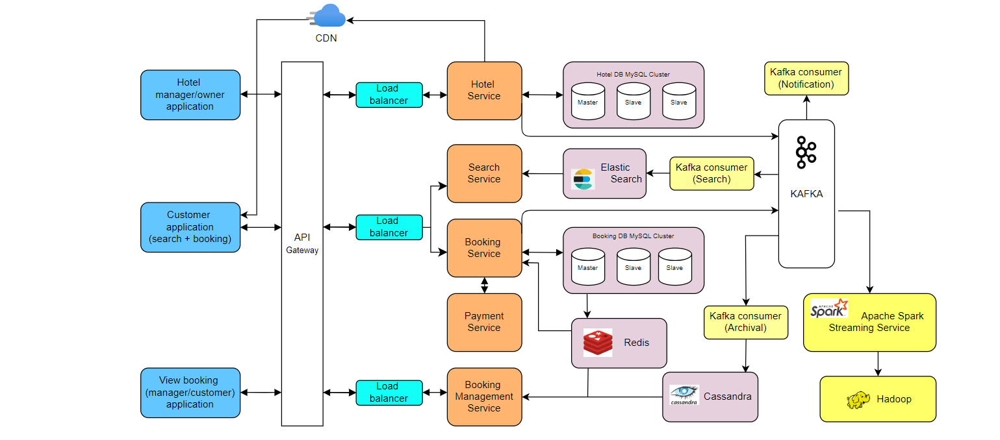

# system-design-concepts

### 1. URL Shortning service:

A URL shortener service is used to generate a short URL/aliases when user enters a long URL. Along with that, when user click on the short URL, it should redirected to original URL.

### 2. Hotel Booking service:

The hotel booking system design is split into 3 major services,

  1. Hotel management service
  2. Customer service with search and booking capabilities
  3. View booking service

